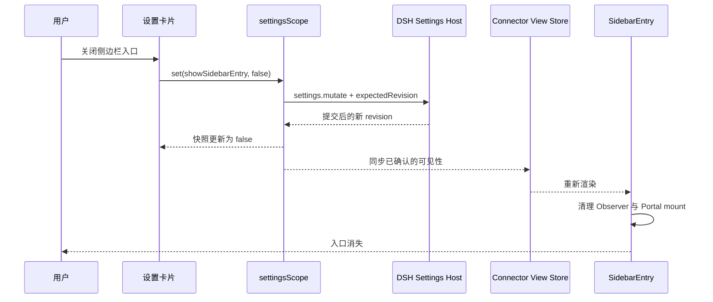
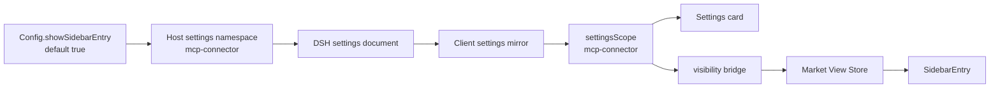

# Issue #63 详细设计：可配置的侧边栏入口

> 状态：已实现（v0.2.38；弹框层级修复 v0.2.39）
> Issue：https://github.com/duhu2000/dsh-mcp-connector/issues/63
> 基线：`main@aa918f2257eb1cdf5d9a9bdd90e847a5c6f9dbd8`（v0.2.37）
> 目标版本：v0.2.38

## 1. 背景与问题

MCP连接器当前无条件在 DSH 左侧栏注册入口，并通过 React Portal 将按钮放到“新会话”下、“工作区”上。该位置提升了新用户的自然发现率，但对已经完成配置、平时很少打开连接器市场的用户，会长期占用一整行侧边栏空间。

Issue #63 希望增加设置入口，让用户选择是否在侧边栏显示“MCP连接器”。

### 1.1 当前 DSH 页面事实

根据 DSH Desktop 当前页面核对，三个容易混淆的入口分别承担不同职责：

| 当前路径 | 当前可见内容 | 职责 | 本功能处理方式 |
|---|---|---|---|
| `设置 → 插件 → 插件配置` | 终端、Agent 循环、网页搜索、上下文、插件市场、视觉引擎等配置卡片；**当前没有 MCP连接器** | 展示已注册 Settings namespace 的用户可编辑配置 | 本功能实现后在这里**新增**“MCP连接器”配置卡片 |
| `设置 → 插件 → 插件列表` | `mcp-connector`、`mcp-client` 等 Cordis 条目及“已启用 / 已挂载”状态 | 运行时插件清单与诊断 | 保持现状，不承载行为偏好 |
| `设置 → 插件市场 → 已安装` | `dsh-mcp-connector v0.2.37` 等市场包，含启用、更新、卸载操作 | 插件包安装与生命周期管理 | 保持现状，不在市场卡片中增加侧边栏开关 |

因此，“`设置 → 插件 → 插件配置 → MCP连接器`”是**目标信息架构**，不是当前已存在的页面路径。当前找不到该卡片并非用户操作错误，而是 MCP连接器尚未注册 Settings namespace 与对应配置卡片。

当前实现存在三个直接约束：

1. `SidebarEntry` 始终创建入口按钮，没有可见性状态。
2. 插件始终注册 `sidebar.footer.action`，并在挂载后创建 Portal 容器与 `MutationObserver`。
3. 如果只把开关放进 MCP连接器市场，用户隐藏入口后将无法从同一路径重新打开市场，形成“自锁”。

## 2. 设计结论

采纳 Issue #63，按以下产品规则实现：

- 设置位置：**DSH 设置 → 插件 → 插件配置 → MCP连接器**。
- 设置项：**在侧边栏显示 MCP连接器**。
- 快捷动作：**打开 MCP连接器**，直接唤起现有连接器弹框，不依赖侧边栏入口。
- 默认值：`true`，保持当前行为和自然发现能力。
- 作用域：当前 DSH profile，全 Workspace 共用。
- 生效方式：保存成功后立即生效，不要求重启。
- 隐藏范围：只隐藏左侧入口，不停用插件、已连接 MCP Server、工具、后台刷新或对话工具。
- 恢复路径：即使入口已隐藏，用户仍可从 DSH 原生设置页重新开启。
- 兼容策略：宿主缺少 Settings 能力时继续显示入口，不让插件加载失败。

建议优先级为 P2：属于明确、低风险收益的 UX 增强，不阻塞当前发布。

## 3. 目标与非目标

### 3.1 目标

1. 用户可以在 DSH 原生设置界面显示或隐藏侧边栏入口。
2. 设置持久化到 DSH 用户设置文档，并在 Desktop 重启后保留。
3. 隐藏后存在稳定、可发现的重新开启路径。
4. 用户无需恢复侧边栏入口，也能从设置卡片临时打开、连接和使用 MCP连接器。
5. 新装、升级和旧 Host 均保持安全的默认行为。
6. 不重新引入 Host 版本专属的客户端模块依赖。

### 3.2 非目标

- 不允许按 Workspace 分别配置入口。
- 不移动入口到新的侧边栏位置。
- 不提供入口排序或拖拽。
- 不隐藏 DSH 设置页中的 MCP连接器配置卡片。
- 不把侧边栏开关放进“插件市场 → 已安装”的包管理卡片。
- 不把侧边栏开关放进“插件 → 插件列表”的 Cordis 运行时条目。
- 不停用 MCP连接器 Host 插件或其 MCP 工具。
- 不复制第二套连接器市场或连接管理界面；快捷按钮复用现有 `MarketOverlay`。
- 不新增独立 HTTP Preferences API。
- 不使用 `localStorage`、`sessionStorage` 或 Cookie 作为事实源。

## 4. 用户体验设计

### 4.1 设置位置

在 DSH 已有的插件配置页中新增 MCP连接器卡片：

```text
设置
└── 插件
    └── 插件配置
        ├── 终端 / Agent 循环 / 网页搜索 / …   [现有卡片]
        └── MCP连接器                           [本功能新增]
            ├── 在侧边栏显示 MCP连接器       [开关]
            ├── 关闭后仍可从这里重新开启       [说明]
            ├── 打开 MCP连接器                  [快捷动作]
            └── 恢复默认                       [可选动作]
```

不新增顶级“设置”导航项，也不复用“插件市场 → 已安装”或“插件 → 插件列表”。前者负责包安装、更新、启停和卸载，后者负责 Cordis 运行时状态；“插件配置”才是 DSH 为外部插件用户偏好提供的原生位置。

卡片外观遵循当前原生页面：默认是与“终端”“Agent 循环”等一致的折叠卡片；展开后显示开关、说明、保存状态、“恢复默认”和“打开 MCP连接器”。卡片本身不依赖侧边栏入口，所以入口隐藏后仍可在此恢复，也可直接临时打开连接器弹框，用完即关。

### 4.2 文案

中文：

- 卡片标题：`MCP连接器`
- 设置标题：`在侧边栏显示 MCP连接器`
- 设置说明：`关闭后只隐藏入口，不影响已连接的 MCP Server 和工具；可随时从这里重新开启。`
- 快捷动作：`打开 MCP连接器`
- 保存中：`正在保存…`
- 保存失败：`设置未保存，请重试。`
- 不可写：`当前页面不能修改本机设置，请在 DSH Desktop 或本机 Web 页面中操作。`

英文：

- Card: `MCP Connector`
- Setting: `Show MCP Connector in the sidebar`
- Description: `Turning this off only hides the shortcut. Connected MCP servers and tools remain available, and you can turn it back on here.`
- Quick action: `Open MCP Connector`
- Saving: `Saving…`
- Failure: `The setting was not saved. Please try again.`
- Read-only: `Local settings cannot be changed from this page. Open DSH Desktop or the local Web UI to update it.`

### 4.3 交互规则

| 场景 | 行为 |
|---|---|
| 新安装 | 默认显示入口 |
| 从旧版本升级且无该设置 | 默认显示入口，不产生迁移写入 |
| 关闭开关 | Host 确认写入后立即移除入口、Portal 容器和观察器 |
| 开启开关 | Host 确认写入后立即恢复入口 |
| 点击“打开 MCP连接器” | 调用共享 View Store 的 `actions.open()`，在设置页上方唤起现有连接器弹框；与侧边栏可见性无关 |
| 关闭连接器弹框 | 返回仍保持原状态的插件配置页，并把焦点还给“打开 MCP连接器”按钮 |
| 保存失败 | 保留上一次已确认状态，展示失败提示 |
| 设置正在加载 | 按 `true` 处理，优先保证入口可恢复和旧 Host 兼容 |
| Settings 服务不可用 | 显示入口；不注册或禁用设置卡片 |
| 非 loopback 页面 | 显示已解析状态；开关只读并解释原因 |
| 侧边栏收起 | 隐藏设置同时作用于窄栏图标，不保留空白占位 |

## 5. 状态模型

### 5.1 Host 设置模型

命名空间：`mcp-connector`

```js
const ConnectorSettings = z.object({
  showSidebarEntry: z.boolean().default(true),
});
```

分层解析顺序遵循 DSH Settings 原生约定：

```text
Schema 默认值 true
        ↓
Cordis entry / bundle base 配置
        ↓
用户 settings 文档中的 mcp-connector.showSidebarEntry
        ↓
最终解析值
```

缺失字段不是错误，也不需要迁移；它自然解析为 `true`。

### 5.2 Client 状态

客户端消费 `settingsScope` 的原生快照：

```ts
type VisibilitySnapshot = {
  status: 'loading' | 'ready' | 'unavailable'
  value?: { showSidebarEntry: boolean }
  writable: boolean
  mode: 'host' | 'memory'
  revision?: number
}
```

可见性派生规则：

```js
function resolveSidebarVisible(snapshot) {
  return snapshot.status === 'ready'
    ? snapshot.value?.showSidebarEntry !== false
    : true;
}
```

这是 fail-open 策略：设置读取异常、Host 过旧或服务缺失时，入口继续存在，用户不会失去访问路径。

### 5.3 冷启动取舍

绑定 `settingsScope` 后先同步读取一次快照；如果此时已经是 `ready`，必须在 Sidebar slot 首次实际渲染前把结果折入 View Store。这样在正常热启动和已就绪镜像中，保存为隐藏的入口不会闪现。

如果镜像仍处于 `loading`，本版本接受入口短暂显示后再隐藏，理由是：

- 不能无限等待一个旧 Host 根本不会提供的设置结果；
- 不引入浏览器本地缓存作为第二事实源；
- fail-open 能保证升级、连接异常和设置损坏时仍有入口。

Desktop 验收需要记录冷启动下是否出现肉眼明显闪烁。如果持续时间达到影响使用的程度，再单独设计“有界等待 + 超时恢复显示”，不在本功能中引入未经测量的缓存层。

### 5.4 状态变更时序



只有 Host 确认后的快照才能改变最终可见性。开关可以显示保存中状态，但不把未提交的草稿当成事实。

## 6. 架构设计

### 6.1 数据流



### 6.2 Host 半

新增 `lib/settings.js`，只依赖当前已有的 Schemastery，并以结构化服务调用注册设置命名空间。

推荐接口：

```js
export const CONNECTOR_SETTINGS_NS = 'mcp-connector';

export const ConnectorSettings = z.object({
  showSidebarEntry: z.boolean().default(true),
});

export function installConnectorSettings(ctx, config) {
  ctx.inject(['settings'], (scoped) => {
    scoped.settings.register(CONNECTOR_SETTINGS_NS, ConnectorSettings, {
      base: { showSidebarEntry: config.showSidebarEntry !== false },
    });
  });
}
```

要求：

- `settings` 是可选服务，不加入 Host 顶层 `inject`。
- 不从 `@deepseek-ai/dsh-settings` 导入版本可能变化的便捷函数或命名导出。
- 不需要监听设置变化来修改 Host 业务状态，因为该字段只控制客户端展示。
- namespace 注册随插件 fiber 自动释放。
- schema 中不得包含凭据、路径或敏感数据。

在 `lib/index.js` 的 `Config` 增加：

```js
showSidebarEntry: z.boolean().default(true),
```

该字段既是部署方可配置的 base，也为旧版 settings 文档提供默认值。

### 6.3 Client 半：可见性桥接

保持当前客户端硬依赖不变：

```js
const inject = ['slots', 'sessions', 'workspaces', 'conversation'];
```

通过 `ctx.inject(['settingsScope'], ...)` 可选接入设置能力，不在 `package.json#dsh.client.inject` 中新增设置包硬依赖，也不在 bundle 中 `require()` 下列模块：

- `@deepseek-ai/dsh-client-ui-settings`
- `@deepseek-ai/dsh-client-runtime/client`
- `@deepseek-ai/dsh-client-ui-primitives`

建议扩展现有 `createMarketViewStore()`：

```js
init: () => ({
  open: false,
  detailOpen: false,
  sidebarVisible: true,
}),
actions: {
  setSidebarVisible(draft, visible) {
    draft.sidebarVisible = visible;
  },
  // existing actions...
}
```

当 `settingsScope` 可用时：

1. bind `mcp-connector` namespace。
2. 读取同步快照并设置一次 `sidebarVisible`。
3. 订阅快照变化。
4. 只把 `status=ready` 的已确认布尔值写入 View Store。
5. teardown 时解除订阅；View Store 回到默认可见状态。

### 6.4 Client 半：SidebarEntry 生命周期

`SidebarEntry` 增加可见性读取：

```js
const visible = useStore((state) => state.sidebarVisible !== false);
```

其 effect 必须依赖 `visible`：

- `visible=true`：执行现有 Portal mount 定位与 MutationObserver 逻辑。
- `visible=false`：不创建 mount、不启动 Observer，并执行前一次 effect 的清理。
- render 在 hooks 调用完成后返回 `null`，避免违反 React hooks 顺序。
- 关闭时已有市场 Overlay 不强制关闭。隐藏的是入口，不是正在进行的用户操作。

不得只给按钮增加 `display:none`。那会遗留 Portal 容器、Observer、footer 注册占位和不可见焦点风险。

侧边栏样式和市场 Overlay 样式需要拆分为两个生命周期：

- Overlay 样式随插件 client apply 常驻，入口隐藏后市场仍可能处于打开状态。
- launcher、Portal 和 `[data-slot="sidebar.footer.action"]` 布局覆盖只在 `visible=true` 时安装，隐藏时一并移除。

这样入口隐藏后，插件不会继续改变其他 footer action 的横纵排列，也不会间接占用额外侧边栏高度。

### 6.5 Client 半：设置卡片

通过以下原生 slot 注册：

```text
settings.plugin.item
key = mcp-connector
```

该 slot 由“设置 → 插件 → 插件配置”页按已注册的 Host settings namespace 分发，因此设置卡片与 Host 能力天然配对。

当前页面没有 MCP连接器卡片是预期基线。只有 Host namespace 注册成功且 Client 对 `settings.plugin.item` 的注册完成后，该卡片才应出现；实现不得通过修改 `dsh-market` 的“已安装”卡片或 Cordis 的“插件列表”条目来伪造配置入口。

卡片实现要求：

- 使用当前 React 运行时和原生可访问 HTML 控件。
- 不值导入其他插件的 SettingsCard 或 UI primitives。
- `input[type=checkbox]` 使用 `role="switch"`、`aria-checked` 和可见 label。
- 使用 `react.useSyncExternalStore(scope.subscribe, scope.getSnapshot)` 订阅设置。
- 写入期间禁用开关并显示保存状态。
- `await scope.set('showSidebarEntry', checked)` 后校验最新快照；若目标值未落盘，展示失败提示。
- 只读或 unavailable 状态下禁用开关并说明原因。
- 可选的“恢复默认”调用 `scope.unset('showSidebarEntry')`，恢复部署 base。
- “打开 MCP连接器”直接调用与侧边栏入口相同的 `marketView.actions.open()`；不得跳转到插件市场、不得新开浏览器页面，也不得复制 `MarketOverlay`。
- 打开动作不读写 `showSidebarEntry`。即使入口已隐藏或设置只读，快捷按钮仍可使用。
- 弹框关闭后恢复焦点到触发按钮；`Escape`、关闭按钮和既有 Overlay 关闭路径保持一致，避免嵌套弹框造成键盘焦点丢失。

### 6.6 本地化

设置卡片至少提供中英文文案。`locale` 服务通过可选嵌套注入接入；如果服务不可用，使用与当前插件一致的中文默认文案，不因此影响入口注册。

本地化能力不能成为 MCP连接器 client bundle 的硬依赖。

## 7. 兼容与降级

### 7.1 Host 能力矩阵

| Host 情况 | 入口 | 设置卡片 | 持久化 |
|---|---|---|---|
| 支持 Host settings + Client settingsScope | 按设置显示 | 显示 | profile 用户设置 |
| 只有 Host settings、无 Client settings UI | 默认显示 | 不显示 | 不产生用户写入 |
| 无 Host settings | 默认显示 | 不显示 | 无 |
| 非 loopback 浏览器 | 按可读取结果显示；读取不到则显示 | 只读或不可用说明 | 不允许远程写入 |
| 旧版 DSH | 默认显示 | 不显示 | 无；插件不得进入 Safe Mode |

### 7.2 Issue #49 回归保护

Issue #49 暴露过客户端模块表和模块到达顺序差异。本功能必须增加静态回归测试，禁止为设置功能引入 Host 版本专属客户端入口依赖。

允许：

- Cordis service name：`settingsScope`
- Slot name：`settings.plugin.item`
- React 18 原生 API

禁止：

- 新增 `require('@deepseek-ai/dsh-client-ui-settings...')`
- 新增 `require('@deepseek-ai/dsh-client-runtime/client')`
- 新增 `require('@deepseek-ai/dsh-client-ui-primitives')`
- 因 Settings 服务缺失而阻塞整个插件 client apply

## 8. 文件改动计划

| 文件 | 计划改动 |
|---|---|
| `lib/settings.js` | 新增 Host 设置 schema、namespace 和可选注册逻辑 |
| `lib/index.js` | Config 增加 `showSidebarEntry`；调用 settings 安装函数 |
| `lib/client.js` | View Store 可见性、settingsScope bridge、设置卡片、SidebarEntry 清理 |
| `cordis.patch.yml` | 可选：显式声明默认 `showSidebarEntry: true`，便于部署方发现 |
| `test/settings.test.mjs` | Host namespace、base、无服务降级、生命周期测试 |
| `test/client.test.mjs` | 可见性、即时切换、卡片写入、只读、清理和依赖纯度测试 |
| `package.json` | lint 加入 `lib/settings.js`；版本在发布 PR 中统一更新 |
| `README.md` / `README.en.md` | 配置字段和用户入口说明 |
| `docs/USER-GUIDE.md` | 隐藏与重新开启路径 |
| `CHANGELOG.md` | 发布阶段记录功能与兼容策略 |

不新增运行时依赖。

## 9. 测试设计

### 9.1 Host 单元测试

1. `settings` 服务存在时注册 namespace `mcp-connector`。
2. schema 默认值是 `showSidebarEntry=true`。
3. Cordis entry 的 `showSidebarEntry=false` 能成为 base。
4. 用户设置可以覆盖 base。
5. unset 后重新继承 base。
6. 没有 `settings` 服务时插件继续启动。
7. 重复 apply/dispose 不泄漏 namespace 或 watcher。

### 9.2 Client 单元测试

1. 没有 settingsScope 时入口保持当前默认显示行为。
2. `loading` / `unavailable` 状态入口显示。
3. `ready + true` 显示完整和窄栏入口。
4. `ready + false` 返回 `null`，不创建 Portal mount，不启动 Observer。
5. `true → false` 时 Observer disconnect 且 owned mounts 全部移除。
6. `false → true` 时入口能重新挂载且不重复创建 mount。
7. 隐藏时移除 sidebar 专属样式，但保留 Overlay 样式。
8. Overlay 和市场 API 不因入口隐藏而卸载。
9. 设置卡片仅在相关 slot 和 settingsScope 可用时注册。
10. 切换调用 `scope.set('showSidebarEntry', value)`。
11. 恢复默认调用 `scope.unset('showSidebarEntry')`。
12. 只读状态禁用控件。
13. 保存没有落盘时显示失败文案并保留已确认状态。
14. bundle 继续拒绝 Host 版本专属 Store、Runtime、Settings 和 UI Primitives 值依赖。
15. 入口隐藏时，“打开 MCP连接器”仍能打开同一个 `MarketOverlay`，关闭后焦点返回设置卡片。
16. 快捷打开不会把 `showSidebarEntry` 改回 `true`，也不会创建第二个 Overlay 实例。
17. 快捷打开的连接器弹框 Portal 到页面根层并高于 Settings；Escape 只关闭最上层连接器弹框。

### 9.3 自动化门禁

```bash
npm run lint
npm test
npm run verify-pack
npm run check
```

必须确认 npm tarball 包含新增 `lib/settings.js`，且敏感内容扫描通过。

### 9.4 Desktop 实机矩阵

| 平台 | 必测场景 |
|---|---|
| macOS DSH Desktop | 默认显示、关闭、重开、重启持久化、折叠栏 |
| Windows DSH Desktop | 安装 PR 包、无 Safe Mode、关闭与恢复、重启持久化 |
| DSH Web loopback | 设置可写、即时同步 |
| 旧 Host / 无 settings service harness | 默认显示、无加载错误 |

Windows 验收应复用 Issue #49 建立的真实 Desktop 加载检查，不只依赖 Windows Node CI。

## 10. 验收标准

满足以下全部条件才能关闭 Issue #63：

1. 新装与升级用户默认仍能看到“MCP连接器”。
2. DSH 原生设置页能关闭入口，操作后无需重启。
3. `设置 → 插件 → 插件配置` 中出现与原生折叠卡片一致的“MCP连接器”配置卡片；当前“插件市场 → 已安装”和“插件 → 插件列表”的职责与页面结构不被改变。
4. 入口隐藏后不残留空白行、不可见按钮、Portal mount 或 Observer。
5. 隐藏不影响已连接 MCP Server、工具调用和 MCP连接器 Host 服务。
6. 用户可以从同一设置页重新开启入口。
7. 入口隐藏时仍可从同一卡片点击“打开 MCP连接器”；连接器弹框显示在设置弹框之上，完成连接与使用后关闭并返回设置页。
8. 快捷打开复用现有 Overlay，不改变侧边栏开关状态，不创建第二套连接器 UI。
9. Desktop 重启后保留设置。
10. 不支持 Settings 的 Host 保持默认显示，且不进入 Safe Mode。
11. macOS、Windows 与 Web 验收通过。
12. `npm run check` 全绿，打包白名单与敏感内容检查通过。
13. 中英文 README 和用户指南同步更新。

## 11. 发布与回滚

### 11.1 发布步骤

1. 从最新 `main` 开发单一目的 PR，关联 `Fixes #63`。
2. CI 全绿后生成 PR 验收 tarball。
3. 维护者完成 macOS/Web 验收。
4. 邀请 Issue 报告人按其原始环境验证；该 Issue 为中文，回复使用中文。
5. Windows Desktop 实机至少完成一次关闭、重启和恢复。
6. 合并后进入下一功能版本统一发布。
7. npm、GitHub Release、版本状态与安装路径核验完成后关闭 Issue。

### 11.2 回滚行为

- 回滚到不识别该字段的旧版本时，旧版本忽略用户设置并恢复显示入口。
- 再次升级到支持版本时，原用户设置仍存在并重新生效。
- 如设置卡片本身故障，入口采用 fail-open，优先恢复为可见。
- 不在回滚过程中删除用户 settings 分节。

## 12. 实施拆分

建议保持一个 PR，但按以下提交拆分：

1. `feat: register mcp connector appearance setting`
   - Host schema、namespace、Config 和 Host 测试。
2. `feat: make sidebar launcher visibility configurable`
   - Client bridge、设置卡片、Portal 生命周期和 Client 测试。
3. `docs: document sidebar visibility preference`
   - 中英文文档、用户指南和设计文档状态更新。

## 13. 评审检查清单

- [ ] 默认值是否仍为显示？
- [ ] 隐藏后的恢复入口是否独立于 MCP连接器入口？
- [ ] 是否只隐藏 UI，不停用连接器和工具？
- [ ] Settings 服务是否保持可选？
- [ ] 是否避免所有版本专属客户端值依赖？
- [ ] 写入是否使用 namespace revision 围栏？
- [ ] 失败时是否保留最后一次 Host 已确认状态？
- [ ] Portal、Observer、styles 是否正确清理？
- [ ] 非 loopback 与旧 Host 是否安全降级？
- [ ] Windows Desktop 是否完成真实加载验收？

## 14. 最终推荐

按本方案进入实现。核心决策是：**使用 DSH 原生 Settings 作为唯一事实源，设置卡片始终提供恢复入口，客户端以可选 service/slot 接入并在能力缺失时默认显示。**

这能同时满足侧边栏空间诉求、插件自然发现、可恢复性和 #49 已建立的跨 Host 兼容边界。
